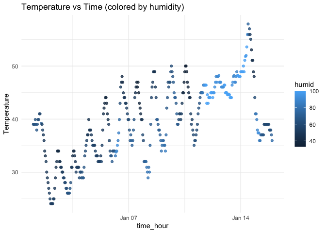

p8105_hw1_xm2356
================
Xinyin Miao (xm2356)
2025-09-12

- [Problem 1](#problem-1)
  - [Dataset description](#dataset-description)
  - [Scatterplot](#scatterplot)
  - [Export the plot](#export-the-plot)
- [Problem 2](#problem-2)
  - [Create a data frame](#create-a-data-frame)
  - [Mean of each variable](#mean-of-each-variable)
  - [Use as.numeric()](#use-asnumeric)
  - [Explanation](#explanation)

# Problem 1

## Dataset description

``` r
data("early_january_weather")
```

The dataset has 358 rows and 15 columns. The mean temperature is
approximately 39.58. Variables include: origin, year, month, day, hour,
temp, dewp, humid, wind_dir, wind_speed, wind_gust, precip, pressure,
visib, time_hour.

## Scatterplot

``` r
p_temp_time <- ggplot(early_january_weather,
                      aes(x = time_hour, y = temp, color = humid)) +
  geom_point(alpha = 0.8) +
  labs(title = "Temperature vs Time (colored by humidity)",
       x = "time_hour",
       y = "Temperature",
       color = "humid") +
  theme_minimal()

p_temp_time
```

<!-- -->

From the scatterplot, temperature shows a clear daily cycle: it tends to
be lowest in the early morning and highest in the afternoon.  
Humidity is higher when the temperature is lower, and drops as the day
warms.

## Export the plot

``` r
ggsave("temp_vs_time.png", plot = p_temp_time, width = 7, height = 4)
```

# Problem 2

## Create a data frame

It involves four types of variables and explore means.

``` r
set.seed(123)
sample_numeric <-  rnorm(10)
sample_logical <-  sample_numeric > 0
sample_character <-  c("apple", "banana", "fish", "dog", "cat", "man", "woman", "book", "store", "test")
sample_factor <- factor(sample(c("low", "medium", "high"), size = 10, replace = TRUE), levels = c("low", "medium", "high"))

library(tibble)
df_types <- tibble(
  number = sample_numeric, 
  is_positive = sample_logical,
  label = sample_character,
  group = sample_factor
)

df_types
```

    ## # A tibble: 10 × 4
    ##     number is_positive label  group 
    ##      <dbl> <lgl>       <chr>  <fct> 
    ##  1 -0.560  FALSE       apple  low   
    ##  2 -0.230  FALSE       banana low   
    ##  3  1.56   TRUE        fish   low   
    ##  4  0.0705 TRUE        dog    low   
    ##  5  0.129  TRUE        cat    high  
    ##  6  1.72   TRUE        man    medium
    ##  7  0.461  TRUE        woman  high  
    ##  8 -1.27   FALSE       book   medium
    ##  9 -0.687  FALSE       store  low   
    ## 10 -0.446  FALSE       test   medium

## Mean of each variable

``` r
mean(df_types %>% pull(number))
```

    ## [1] 0.07462564

``` r
mean(df_types %>% pull(is_positive))
```

    ## [1] 0.5

``` r
mean(df_types %>% pull(label))  # Error: character vectors have no mean
```

    ## Warning in mean.default(df_types %>% pull(label)): argument is not numeric or
    ## logical: returning NA

    ## [1] NA

``` r
mean(df_types %>% pull(group)) # Error: Factors can not be averaged directly
```

    ## Warning in mean.default(df_types %>% pull(group)): argument is not numeric or
    ## logical: returning NA

    ## [1] NA

## Use as.numeric()

``` r
as.numeric(df_types$is_positive)
as.numeric(df_types$label)
as.numeric(df_types$group)
```

## Explanation

For is_positive (logical), as.numeric() converts TRUE to 1 and FALSE to
0. This explains why mean() works directly on logical variables: it is
actually calculating the proportion of TRUE values. For label
(character), as.numeric() returns NA with a warning, because R cannot
interpret arbitrary strings (e.g., “apple”, “dog”) as numbers. For group
(factor), as.numeric() returns the internal integer codes of the factor
levels, not their text labels. To get numeric values corresponding to
the labels themselves, you would first convert to character and then to
numeric, e.g. as.numeric(as.character(group)). Overall, mean() only
works for variables that are numeric or can be implicitly converted to
numeric (such as logical). Character vectors and raw factors cannot be
averaged unless they are transformed into meaningful numeric values
first.
